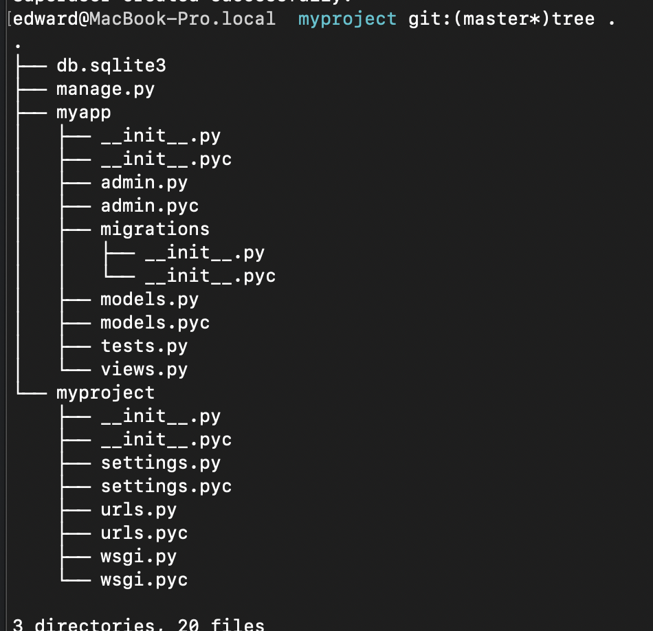

# django

base on 1.8.18 on python2.7


# install & start new project

```
download the targz and cd Django-xxx
sudo python setup.py install 

start new project:
django-admin startproject myproject
```

```sh
edward@MacBook-Pro.local  django git:(master*)django-admin startproject myproject
edward@MacBook-Pro.local  myproject git:(master*)tree .
.
├── manage.py
└── myproject
    ├── __init__.py
    ├── settings.py  
    ├── urls.py
    └── wsgi.py

1 directory, 5 files
```


```
urls.py ---> url mapping
settings.py ---> project conf
wsgi.py --->  Web Server Gateway Interface
```


```
start:
      python manage.py runserver
      
```

## a project = multiple apps

```
python manage.py startapp myapp
```



```
update the myproject/settings.py
INSTALLED_APPS = (
   'django.contrib.admin',
   'django.contrib.auth',
   'django.contrib.contenttypes',
   'django.contrib.sessions',
   'django.contrib.messages',
   'django.contrib.staticfiles',
   'myapp',
)

```

# url mapping

```python
project/urls.py
urlpatterns = [
    url(r'^admin/', include(admin.site.urls)),
    url(r'^myapp/', include('myapp.urls'))
]

myapp/urls.py
urlpatterns = [
    url(r'^hello/', 'myapp.views.hello', name='sayhello'),
    url(r'^hello2/', 'myapp.views.hello2', name='sayhello2'),
    url(r'^hello3/', 'myapp.views.hello3', name='sayhello3'),
    url(r'^article/(\d+)/', 'myapp.views.viewArticle', name = 'article'),
    url(r'^articles/(\d{2})/(\d{4})', 'myapp.views.viewArticles', name = 'articles')
]

in views.py
def hello2(request, number):
    text = "<h1>my number %s</h1> " % number
    return HttpResponse(text)

def hello3(request):
    return render(request, os.path.join(BASE_DIR, 'myapp/template/hello.html'), {})


def viewArticle(request, articleId):
    text = "Displaying article Number : %s"%articleId
    return HttpResponse(text)


def viewArticle(request, month, year):
    '''
    request like this: /myapp/articles/12/2006/
    then: month=12 year=2006
    see the urls.py


    :param request:
    :param month:
    :param year:
    :return:
    '''
    text = "Displaying articles of : %s/%s"%(year, month)
    return HttpResponse(text)


```


# template language


https://docs.djangoproject.com/en/3.1/ref/templates/language/


## The Render Function

This function takes three parameters −

- **Request** − The initial request.
- **The path to the template** − This is the path relative to the TEMPLATE_DIRS option in the project settings.py variables.
- **Dictionary of parameters** − A dictionary that contains all  variables needed in the template. This variable can be created or you  can use locals() to pass all local variable declared in the view.


```python
A variable looks like this: {{variable}}. 

def hello(request):
   today = datetime.datetime.now().date()
   return render(request, "hello.html", {"today" : today})


# for & if else
def hello(request):
   today = datetime.datetime.now().date()
   
   daysOfWeek = ['Mon', 'Tue', 'Wed', 'Thu', 'Fri', 'Sat', 'Sun']
   return render(request, "hello.html", {"today" : today, "days_of_week" : daysOfWeek})

html is below:

```


```html
<html>
   <body>
      
      Hello World!!!<p>Today is {{today}}</p>
      We are
      
      
      the first day of month.
      
      
      the last day of month.
      
      
      I don't know.
      
      
      <p>
         
         {{day}}
      </p>
		
      
      
   </body>
</html>
```


# model

database setup:

https://docs.djangoproject.com/en/3.1/intro/tutorial02/#database-setup


```python
used to manage db
see models.py

from django.db import models

# Create your models here.

class Dreamreal(models.Model):
    website = models.CharField(max_length=100)
    mail = models.CharField(max_length=100)
    name = models.CharField(max_length=100)
    phonenumber = models.IntegerField()


    class Meta:
        db_table = "dreamreal"

```

```python
views.py

def crudops(request):
    dreamreal = Dreamreal(
        website = "www.polo.com", mail = "sorex@polo.com",
        name = "sorex", phonenumber = "002376970"
    )
    dreamreal.save()

    # read
    objs = Dreamreal.objects.all()
    res = "print <br>"
    for o in objs:
        res += o.name + "<br>"

    sorex = Dreamreal.objects.get(name="sorex")
    res += "onentitl:" + str(sorex.phonenumber)

    # delete
    sorex.delete()

    #Update
    dreamreal = Dreamreal(
        website = "www.polo.com", mail = "sorex@polo.com",
        name = "sorex", phonenumber = "002376970"
    )

    dreamreal.save()
    res += 'Updating entry<br>'

    dreamreal = Dreamreal.objects.get(name = 'sorex')
    dreamreal.name = 'thierry'
    dreamreal.save()

    return HttpResponse(res)
```


```shell
python manage.py makemigrations  to create db
python manage.py syncdb  
```


