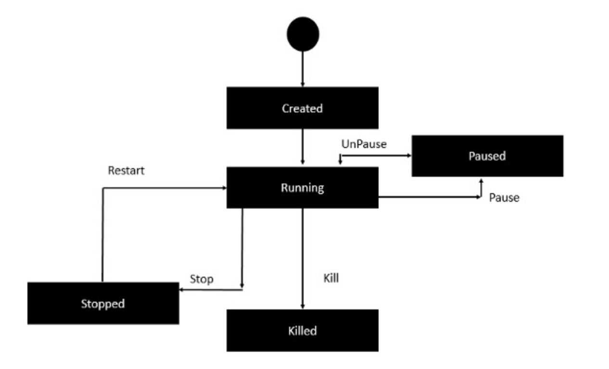
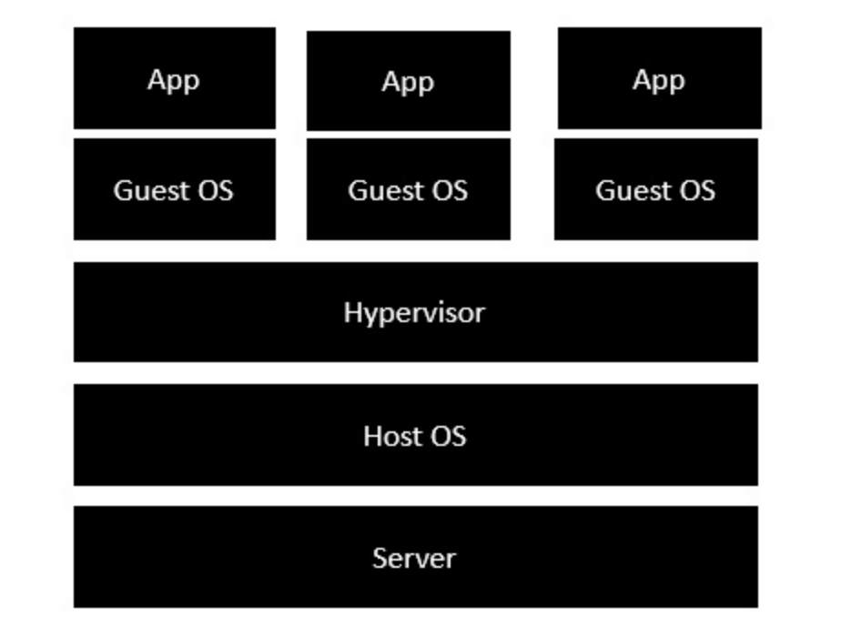
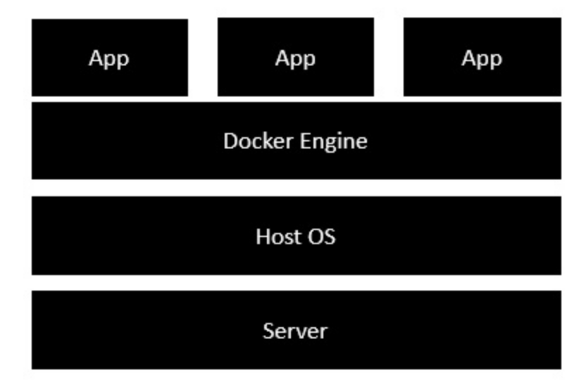

Url: https://www.tutorialspoint.com/docker/

[TOC]

# images

```
docker run imageName
       Example:  docker run centos 
                 docker run centos 
docker images  
docker rmi imageID  --- delete some images

docker inspect imageName   
        Example:  docker inspect centos
        
export/save an image:
docker save -o broker_dev.tar broker:dev

import an image
docker import rasa.tar rasa:latest
```

```
recreate a image base on existed image
docker commit [OPTIONS] CONTAINER [REPOSITORY[:TAG]]

docker commit fc58761b16a6 localhost:5000/rasafix:latest

# push to repo
docker push register-domain/hackgod/hackgod-base:1.0

```


# containers

```
-- run with a bash open...  
-- it means interactive
docker run -it centos /bin/bash

-- run in background
docker run -d centos 

docker ps

-- get a history of commands in some image
docker history centos

docker stop containerId
docker rm containerId

```




# arch

visulation arch:



docker arch:



# configure

```
---stop docker daemon
service docker stop

```

# docker files


an example of Dockerfile (the filename *MUSTBE* Dockerfile)

```
#This is a sample Image 
FROM ubuntu 
MAINTAINER demousr@gmail.com 

RUN apt-get update 
RUN apt-get install –y nginx 
CMD [“echo”,”Image created”] 
```


Build docker image base on Dockerfile

```
 docker build -t ImageName:TagName dirXXX
 docker build -t myubuntu:dev .
 
 
```


publish your images to public repo:

```
1. login
docker login

2. build tag
docker tag imageID  repoName
example: docker tag abcd1234566  demoUser/demoRep:1.0


```

# ports

use below to search exposed ports:

```
docker inspect mysql

and search
"ExposedPorts": {
                "3306/tcp": {},
                "33060/tcp": {}
            },
```

```
docker run -p physicPort:containerPort [more port mapping] mysql
example:
docker run -p 33060:3306 mysql
access outside with port 33060

run with environments 
docker run --restart always -d --name kbmysql -v /root/kbdata/mysql:/var/lib/mysql -e "MYSQL_ROOT_PASSWORD=changeit" -p 33060:3306 mysql:5.7

```


# private registry

public registry=docker hub

How to build:

```
You might have the need to have your own private repositories. You may not want to host the repositories on Docker Hub. For this, there is a repository container itself from Docker. Let’s see how we can download and use the container for registry.
```

Step 1: download the private docker registry 

```
docker run -d -p 5000:5000 -v /data/localreg:/var/lib/registry:rw --name registry registry 
// --name give another name to diff

docker run --restart always -d -p 5000:5000 -v /root/kbdata/registry:/var/lib/registry:rw --name kbregistry registry 
```

Step 2: retag

```
docker tag imageId localhost:5000/redis
example:
docker tag 4cdbec704e47 localhost:5000/myregistryredis


```

Step 3: push

```
docker push localhost:5000/myregistryredis
```

Step 4: run

```
docker run localhost:5000/myregistryredis
```


# build a web server

vi Dockerfile   note the font

```
FROM ubuntu 
RUN apt-get update --fix-missing
RUN apt-get install -y apache2 
RUN apt-get install -y apache2-utils 
RUN apt-get clean 
EXPOSE 80 CMD ["apache2ctl", "-D", "FOREGROUND"]
```

add **--fix-missing** to avoid blocking when update.

```
docker build -t="mywebserver" .
```

```
docker run -d -p 8090:80 mywebserver
```

```
if you run docker ubuntu exited:
run with:  docker run -it ubuntu
```

# commands


the differences:

- RUN executes command(s) in a new layer and creates a new image. E.g., it is often used for **installing software packages**.
- CMD sets **default command** and/or parameters, which can be overwritten from command line when docker container runs. 
- ENTRYPOINT configures a container that will run as an executable.


## CMD


```
CMD command1 param1 param2
```

```
Example:
1/ Dockerfile

#This is a sample Image 
FROM ubuntu 
MAINTAINER gaoxingliang@outlook.com 

CMD ["echo", "hello"] 


2/ docker build -t="test" . 
3/ docker run test
```

Output:

```
edward@MacBookPro.local  tempdocker docker run test
hello
```

## ENTRYPOINT

```
ENTRYPOINT command1 param1
```

```
FROM ubuntu 
MAINTAINER demousr@gmail.com 
ENTRYPOINT ["echo", "Hello"]
```

entrypoint will always run:

```
FROM ubuntu 
MAINTAINER demousr@gmail.com 
CMD ["echo", "from cmd"]
ENTRYPOINT ["echo", "from entrypoint"]
```

```
edward@MacBookPro.local  tempdocker docker run test         
from entrypoint echo from cmd
edward@MacBookPro.local  tempdocker docker run -it test /bin/bash
from entrypoint /bin/bash
```

## ENV

```
ENV key value
```

```
FROM ubuntu
ENV var1=Test var2=point
```

## WORKDIR

```
WORKDIR dirXXX
```

if dir not exists, will create

```
FROM ubuntu 
MAINTAINER demousr@gmail.com 
WORKDIR /tmp
CMD pwd
```

# container linking

allows multiple containers to link with each other. It is a better option than exposing ports

start a container A:

```
docker run -d --name=mysqla -e MYSQL_ROOT_PASSWORD=changeit -it mysql
```

start another container B:

```
 docker run --name=containerb --link=mysqla:mysql-in-docker -it ubuntu /bin/bash
```

then type *env*:

```
root@a464fff712b5:/# env
LS_COLORS=...
MYSQL_IN_DOCKER_PORT_3306_TCP_PORT=3306
HOSTNAME=a464fff712b5
MYSQL_IN_DOCKER_ENV_GOSU_VERSION=1.7
MYSQL_IN_DOCKER_PORT_33060_TCP=tcp://172.17.0.4:33060
MYSQL_IN_DOCKER_ENV_MYSQL_MAJOR=8.0
MYSQL_IN_DOCKER_PORT_3306_TCP_PROTO=tcp
PWD=/
HOME=/root
MYSQL_IN_DOCKER_ENV_MYSQL_ROOT_PASSWORD=changeit
MYSQL_IN_DOCKER_PORT_3306_TCP_ADDR=172.17.0.4
MYSQL_IN_DOCKER_PORT_33060_TCP_ADDR=172.17.0.4
MYSQL_IN_DOCKER_PORT_3306_TCP=tcp://172.17.0.4:3306
MYSQL_IN_DOCKER_PORT_33060_TCP_PORT=33060
TERM=xterm
MYSQL_IN_DOCKER_PORT=tcp://172.17.0.4:3306
MYSQL_IN_DOCKER_PORT_33060_TCP_PROTO=tcp

```

# storage

data volumes: shared between container, exists even after container is delted.

```
docker run -v /Users/edward/Documents/tempdocker/mysqlDataFolder:/var/lib/mysql -p 33306:3306 -d  --name=mynewmysql -e MYSQL_ROOT_PASSWORD=changeit -it mysql
```

use *docker inspect mysql* to get the mounts information.

# networking

```
docker network ls
docker network inspect znet_docker
```

create a network:

```
docker network create --driver bridge my_network
```

run with this network:

```
docker run --network=my_network -it ubuntu /bin/bash
```


# nodejs

```
docker pull node
```

vi Hello.js

console.log("hello");

```
docker run -it -v "$PWD":/usr/src/app -w /usr/src/app node node Hello.js 
```

// -w is set the working dir


# mongodb

```
docker pull mongo
docker run -p 27017:27017 -d mongo 
```

use docker insepect to get the volume info

```
 "Volumes": {
                "/data/configdb": {},
                "/data/db": {}
            },

```

```
docker run -v /Users/edward/Documents/tempdocker/mongodbdata:/data/db -v /Users/edward/Documents/tempdocker/mongodbdataconfig:/data/configdb -p 27017:27017 -d mongo /bin/bash
```

Note **MUST BE ABSOLUTE PATH** when use **-v**

 # nginx

```
docker run -p 8090:80 -d nginx
```


# logs

```
docker logs containerID
```


# docker-compose

```
# install
curl -L "https://github.com/docker/compose/releases/download/1.10.0-rc2/dockercompose
   -$(uname -s) -$(uname -m)" -o /home/demo/docker-compose
```

```
edward@MacBookPro.local  tempdocker cat docker-compose.myfirstapp.yml 

version:  "2"
services:
  databases:
    image:  mysql
    ports:
      - "33060:3306"
    environment:
      - MYSQL_ROOT_PASSWORD=changeit
  web:
    image: nginx

```

```
docker-compose -f docker-compose.myfirstapp.yml up -d
```

# k8s

- **etcd** − This component is a highly available **key-value** store that is used for storing **shared configuration** and **service discovery**. Here the various applications will be able to connect to the services via the **discovery service**.
- **Flannel** − This is a backend network which is required for the containers.
- **kube-apiserver** − This is an API which can be used to orchestrate the Docker containers.
- **kube-controller-manager** − This is used to control the **Kubernetes services**.
- **kube-scheduler** − This is used to schedule the containers on hosts.
- **Kubelet** − This is used to control the launching of containers via **manifest files**.
- **kube-proxy** − This is used to provide network proxy services to the outside world.

