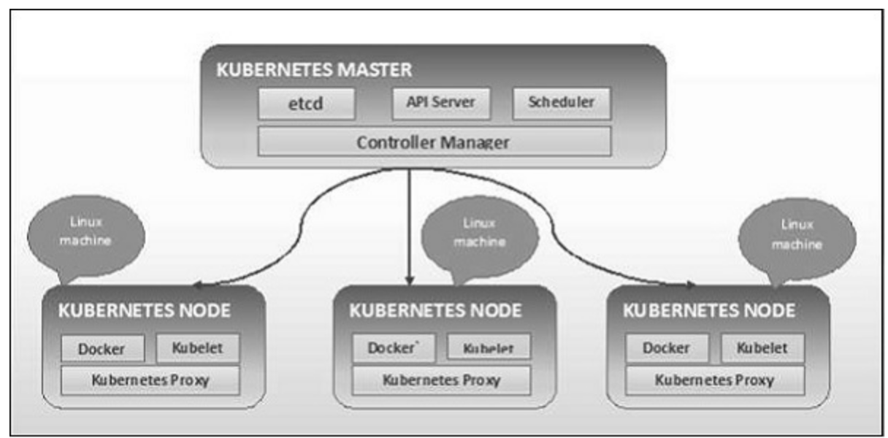
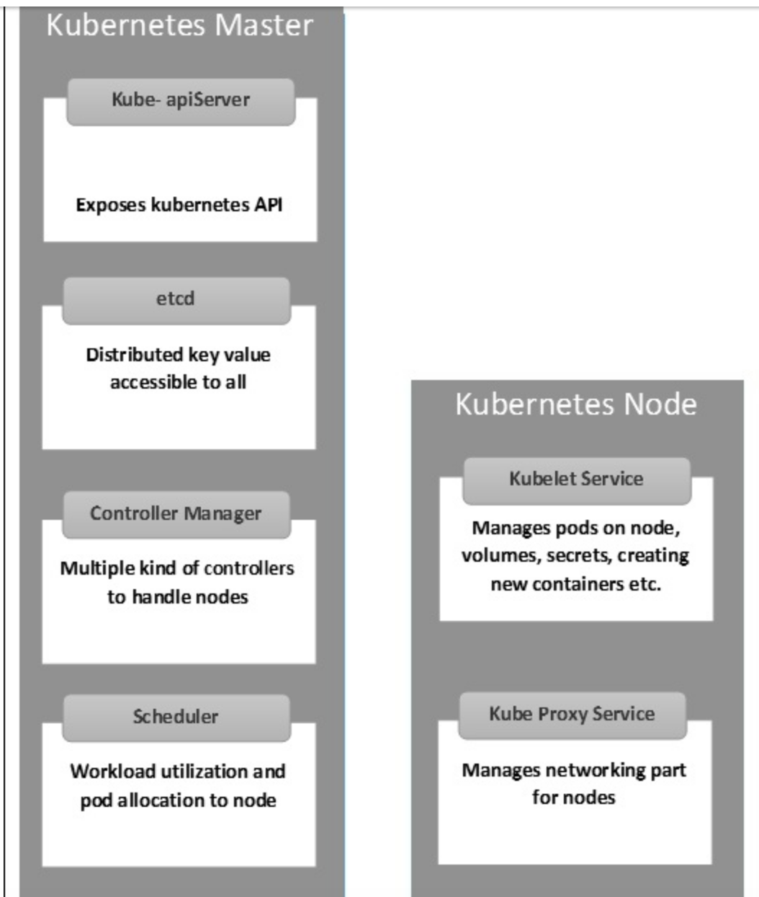

[TOC]

# home

k8s is used to mange containerized infrastructure and app deployment.

- Continues development, integration and deployment
- Containerized infrastructure
- Application-centric management
- Auto-scalable infrastructure
- Environment consistency across development testing and production
- Loosely coupled infrastructure, where each component can act as a separate unit
- Higher density of resource utilization
- Predictable infrastructure which is going to be created

from **host centric** to **container centric**

Refs:

[Concepts official home](https://kubernetes.io/docs/concepts/)

[tutorial home](https://www.tutorialspoint.com/kubernetes/)

[kubectl ref](https://kubernetes.io/docs/reference/generated/kubectl/kubectl-commands)


# cluster arch





# images

```
edward@MacBookPro.local  tempdocker cat k8s_test.yml 
apiVersion: v1
kind: Pod
metadata:
  name: test-image-forpull
spec:
  containers:
  - name: neo4jserver
    image: neo4j:4.0.0
    imagePullPolicy: Always
    command: ["echo", "success"]
```


```
kubectl create -f k8s_test.yml
kubectl logs test-image-forpull
```


# labels and selectors

```
apiVersion: v1
kind: Service
metadata:
  name: sp-neo4j-standalone
spec:
  ports:
    - 
      port: 7474
      name: neo4j
  type: NodePort
  selector:
    app: salesplatform 
    component: neo4j

```


# namespaces

```sh
vi k8s_namespace.yml
apiVersion: v1
kind: Namespace
metadata:
  name: elk

kubectl create -f k8s_namespace.yml 

```


```sh
kubectl get|describe|delete namespace namespaceXXX
```


```
edward@MacBookPro.local  tempdocker cat k8s_namespace_es.yml 
apiVersion: v1
kind: Service
metadata:
  name: elasticsear
  namespace: elk
  labels: 
    component: elasticsearchlabel
spec:
  type: LoadBalancer
  selector:
    component: elasticsearchlabel
  ports:
  - name: http
    port: 9200
    protocol: TCP
  - name: transport
    port: 9300
    protocol: TCP
```

https://www.jianshu.com/p/cd6b4b4caaab

# node

A node is a working machine in Kubernetes cluster which is also known as a minion. They are working units which can be physical, VM, or a cloud  instance.

```
apiVersion: v1
kind: Node
metadata:
  name: 127.0.0.1
  labels:
    name: ALocalHost
```


# service

service= logical set of pods

It can be defined as an abstraction on the top of the pod which provides a single IP address and DNS name by which pods can be accessed. 

```
apiVersion: v1
kind: Service
metadata:
   name: tutorialpointservice
spec:
   selector:
      application: MyApplication
   ports:
   - port: 8080
     targetPort: 31999
```

```
apiVersion: v1
kind: Service
metadata:
   name: Tutorial_point_service
spec:
   selector:
      application: “My Application” -------------------> (Selector)
   ClusterIP: 10.3.0.12
   ports:
      -name: http
      protocol: TCP
      port: 80
      targetPort: 31999
   -name:https
      Protocol: TCP
      Port: 443
      targetPort: 31998
```


```
apiVersion: v1
kind: Service
metadata:
   name: appname
   labels:
      k8s-app: appname
spec:
   type: NodePort
   ports:
   - port: 8080
      nodePort: 31999
      name: omninginx
   selector:
      k8s-app: appname
      component: nginx
      env: env_name
```


# pod

There are two types of Pods −

- Single container pod
- Multi container pod

```yml
edward@MacBookPro.local  tempdocker cat tomcatPod.yml 

apiVersion: v1
kind: Pod
metadata:
   name: mytomcat
spec:
   containers:
   - name: mytomcat
     image: tomcat:8.0
     ports:
       - containerPort: 7500
     imagePullPolicy: Always
```

```yml
apiVersion: v1
kind: Pod
metadata:
   name: Tomcat
spec:
   containers:
   - name: Tomcat
     image: tomcat: 8.0
     ports:
       - containerPort: 7500
     imagePullPolicy: Always
   - name: Database
     image: mongoDB
     ports:
     - containerPort: 7501
     imagePullPolicy: Always

```


# port

a lot of ports:  port , container port, node port, target port

## port

port是k8s集群内部访问service的端口，即通过clusterIP: port可以访问到某个service

## nodePort

nodePort是外部访问k8s集群中service的端口，通过nodeIP: nodePort可以从外部访问到某个service。

## targetPort

targetPort是pod的端口，从port和nodePort来的流量经过kube-proxy流入到后端pod的targetPort上，最后进入容器。

## containerPort

containerPort是pod内部容器的端口，targetPort映射到containerPort。


# 完整的mysql + web的demo

ref: https://www.jianshu.com/p/38c129a50479


# replication controller


```yml
apiVersion: v1
kind: ReplicationController 
metadata:
   name: tomcat-replicationcontroller 
spec:
   replicas: 3 
   template:
      metadata:
         name: tomcat-replicationcontroller
         labels:
           app: App
           component: neo4j
      spec:
         containers:
         - 
           name: tomcat
           image: tomcat
           ports:
             - containerPort: 8080
```

会启动3个tomcat.

然后在配合如下的service 可以实现多tomcat负载均衡:

```
edward@MacBookPro.local  tempdocker cat multiple_tomcat_service.yaml 

apiVersion: v1
kind: Service
metadata:
   name: multipletomcatservice
spec:
   selector:
      app: App
   type: NodePort
   ports:
   - port: 8080
    # targetPort: 31999
     nodePort: 30111
```


# replica set

Replica Set ensures how many replica of pod should be running. It can be considered as a replacement of replication controller. The key  difference between the replica set and the replication controller is,  the replication controller only supports equality-based selector whereas the replica set supports set-based selector.

```
apiVersion: extensions/v1beta1 --------------------->1
kind: ReplicaSet --------------------------> 2
metadata:
   name: Tomcat-ReplicaSet
spec:
   replicas: 3
   selector:
      matchLables:
         tier: Backend ------------------> 3
      matchExpression:
{ key: tier, operation: In, values: [Backend]} --------------> 4
template:
   metadata:
      lables:
         app: Tomcat-ReplicaSet
         tier: Backend
      labels:
         app: App
         component: neo4j
   spec:
      containers:
      - name: Tomcat
      image: tomcat: 8.0
      ports:
      - containerPort: 7474
```


# volumes

types of vols:

- **emptyDir** − It is a type of volume that is created when a  Pod is first assigned to a Node. It remains active as long as the Pod is running on that node. The volume is initially empty and the containers  in the pod can read and write the files in the emptyDir volume. Once the Pod is removed from the node, the data in the emptyDir is erased.
- **hostPath** − This type of volume mounts a file or directory from the host node’s filesystem into your pod.
- **gcePersistentDisk** − This type of volume mounts a Google Compute Engine (GCE) Persistent Disk into your Pod. The data in a **gcePersistentDisk** remains intact when the Pod is removed from the node.
- **awsElasticBlockStore** − This type of volume mounts an Amazon Web Services (AWS) Elastic Block Store into your Pod. Just like **gcePersistentDisk**, the data in an **awsElasticBlockStore** remains intact when the Pod is removed from the node.
- **nfs** − An **nfs** volume allows an existing NFS (Network File System) to be mounted into your pod. The data in an **nfs** volume is not erased when the Pod is removed from the node. The volume is only unmounted.
- **iscsi** − An **iscsi** volume allows an existing iSCSI (SCSI over IP) volume to be mounted into your pod.
- **flocker** − It is an open-source clustered container data volume manager. It is used for managing data volumes. A **flocker** volume allows a Flocker dataset to be mounted into a pod. If the  dataset does not exist in Flocker, then you first need to create it by  using the Flocker API.
- **glusterfs** − Glusterfs is an open-source networked filesystem. A glusterfs volume allows a glusterfs volume to be mounted into your pod.
- **rbd** − RBD stands for Rados Block Device. An **rbd**  volume allows a Rados Block Device volume to be mounted into your pod.  Data remains preserved after the Pod is removed from the node.
- **cephfs** − A **cephfs** volume allows an existing CephFS  volume to be mounted into your pod. Data remains intact after the Pod is removed from the node.
- **gitRepo** − A **gitRepo** volume mounts an empty directory and clones a **git** repository into it for your pod to use.
- **secret** − A **secret** volume is used to pass sensitive information, such as passwords, to pods.
- **persistentVolumeClaim** − A **persistentVolumeClaim**  volume is used to mount a PersistentVolume into a pod. PersistentVolumes are a way for users to “claim” durable storage (such as a GCE  PersistentDisk or an iSCSI volume) without knowing the details of the  particular cloud environment.
- **downwardAPI** − A **downwardAPI** volume is used to make  downward API data available to applications. It mounts a directory and  writes the requested data in plain text files.
- **azureDiskVolume** − An **AzureDiskVolume** is used to mount a Microsoft Azure Data Disk into a Pod.

Note hostPath and secret

## create persistent vol

```
cat pv.yaml 

kind: PersistentVolume
apiVersion: v1
metadata:
  name: pv1
  labels:
    type: local
spec:
  capacity:
    storage: 1G
  accessModes:
    - ReadWriteOnce

  hostPath:
      path: "/Users/edward/Documents/tempdocker/mysql_web_demo/"
```


```
edward@MacBookPro.local  tempdocker cat nginxpvTest.yaml 
kind: Pod
apiVersion: v1
metadata:
  name: mynginxwithpv
spec:
  containers:
    - name: mynginx
      image: nginx
      ports:
        - containerPort: 80
      volumeMounts:
        - mountPath: "/usr/share/tomcat/html"
          name: mypd
  volumes:
     - name: mypd
       hostPath: 
         path: /Users/edward/Documents/tempdocker/mysql_web_demo
```


# secrets

Two type of create secrets:

- Creating from txt files.
- Creating from yaml file.

## create from txt

```
echo -n 'admin' > ./username.txt
echo -n '1f2d1e2e67df' > ./password.txt
```


```
kubectl create secret generic db-user-pass --from-file=username.txt --from-file=password.txt            
```

```
kubectl get secrets
kubectl describe secrets/db-user-pass

edward@MacBookPro.local  tempdocker kubectl describe secrets/db-user-pass
Name:         db-user-pass
Namespace:    default
Labels:       <none>
Annotations:  <none>

Type:  Opaque

Data
====
username.txt:  5 bytes
password.txt:  12 bytes
```


### decode the secrets

```
kubectl get secret db-user-pass -o yaml               
apiVersion: v1
data:
  password.txt: MWYyZDFlMmU2N2Rm
  username.txt: YWRtaW4=
kind: Secret
metadata:
  creationTimestamp: "2020-04-15T12:38:59Z"
  name: db-user-pass
  namespace: default
  resourceVersion: "866348"
  selfLink: /api/v1/namespaces/default/secrets/db-user-pass
  uid: d2e866f1-f1de-4e9a-a3c1-1f094c14a0f6
type: Opaque

```

```
echo 'YWRtaW4=' | base64 --decode

echo 'admin' | base64 --encode
```

## create from yaml

```
apiVersion: v1
kind: Secret
metadata:
  name: mysecret
type: Opaque
data:
  username: YWRtaW4=
  password: MWYyZDFlMmU2N2Rm
```

## use secrets by env

```
apiVersion: v1
kind: Pod
metadata:
  name: secret-env-pod
spec:
  containers:
  - name: mycontainer
    image: redis
    env:
      - name: SECRET_USERNAME
        valueFrom:
          secretKeyRef:
            name: mysecret
            key: username
      - name: SECRET_PASSWORD
        valueFrom:
          secretKeyRef:
            name: mysecret
            key: password
  restartPolicy: Never
```


## use secrets by volume

```
apiVersion: v1
kind: Pod
metadata:
  name: mypod
spec:
  containers:
  - name: mypod
    image: redis
    volumeMounts:
    - name: foo
      mountPath: "/etc/foo"
      readOnly: true
  volumes:
  - name: foo
    secret:
      secretName: mysecret
```


# kubectl commands

https://www.tutorialspoint.com/kubernetes/kubernetes_kubectl_commands.htm

```
get current context:

kubectl config current-context
```


```
copy a file into|from container
kubectl cp macos.txt mysql-lzrqf:/

kubectl cp myweb-664s7:/usr/local/tomcat/logs/catalina.2020-04-14.log /Users/edward/Documents/tempdocker/b.log
# 虽然有下面的错误 but it worked
tar: Removing leading `/' from member names
see- https://github.com/kubernetes/kubernetes/issues/58692
```


# dashboard

ref guide: https://kubernetes.io/docs/tasks/access-application-cluster/web-ui-dashboard/

