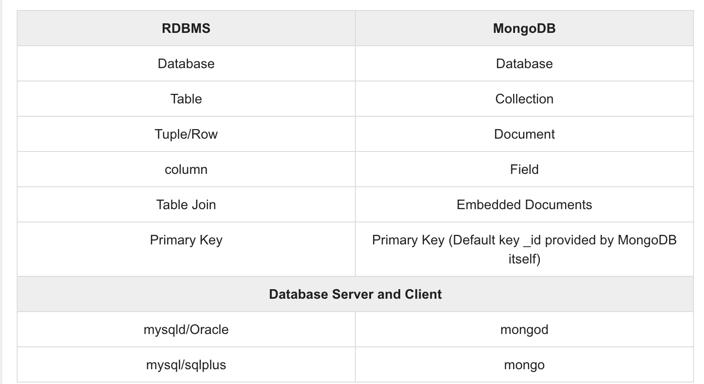
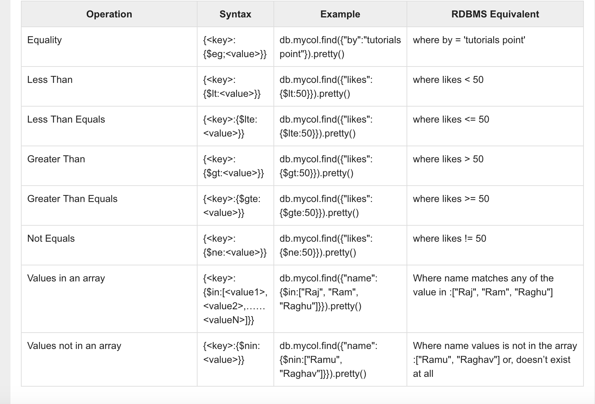

[TOC]

# base concepts



# install

```
docker pull mongo
docker run -d -p 27017:27017 --name mongo -v /Users/edward/projects/tempHere/mongodata/data:/data/ mongo
```

# design considerations


- Design your schema according to user requirements.
- Combine objects into one document if you will use them together.  Otherwise separate them (but make sure there should not be need of  joins).
- Duplicate the data (but limited) because disk space is cheap as compare to compute time.
- Do joins while write, not on read.
- Optimize your schema for most frequent use cases.
- Do complex aggregation in the schema.

# db related

```
use xxxdb;

db.dropDatabase()

```

```
 db.createCollection("myCreateTestOption", {capped:true, max:10, size:1024});
```


options:

|    Field    |  Type   |                         Description                          |
| :---------: | :-----: | :----------------------------------------------------------: |
|   capped    | Boolean | (Optional) If true, enables a capped collection. Capped collection  is a fixed size collection that automatically overwrites its oldest  entries when it reaches its maximum size. **If you specify true, you need to specify size parameter also.** |
| autoIndexId | Boolean | (Optional) If true, automatically create index on _id field.s Default value is false. |
|    size     | number  | (Optional) Specifies a maximum size in bytes for a capped collection. **If capped is true, then you need to specify this field also.** |
|     max     | number  | (Optional) Specifies the maximum number of documents allowed in the capped collection. |


```
db.COLLECTIONXXXX.drop()
```

# insert

```
db.COLLECTION_NAME.insert(document)
```

```
db.post.insert([
	{
		title: "MongoDB Overview",
		description: "MongoDB is no SQL database",
		by: "tutorials point",
		url: "http://www.tutorialspoint.com",
		tags: ["mongodb", "database", "NoSQL"],
		likes: 100
	},
	{
	title: "NoSQL Database",
	description: "NoSQL database doesn't have tables",
	by: "tutorials point",
	url: "http://www.tutorialspoint.com",
	tags: ["mongodb", "database", "NoSQL"],
	likes: 20,
	comments: [
		{
			user:"user1",
			message: "My first comment",
			dateCreated: new Date(2013,11,10,2,35),
			like: 0
		}
	]
}
])
```

# find

```
db.post.find()
db.post.find().pretty()

db.post.findOne()
```




Example:

```
db.users.insert({"user": 345, "pass": 789, "man": true})


db.users.find({"man":true})
db.users.find({"user":{$gt:300}})
```


## AND

```
>db.mycol.find({ $and: [ {<key1>:<value1>}, { <key2>:<value2>} ] })
```

```
db.mycol.find({$and:[{"by":"tutorials point"},{"title": "MongoDB Overview"}]}).pretty()
```

## OR

```
db.mycol.find(
   {
      $or: [
         {key1: value1}, {key2:value2}
      ]
   }
).pretty()


SQL: 'where likes>10 AND (by = 'tutorials point' OR title = 'MongoDB Overview')'

>db.mycol.find({"likes": {$gt:10}, $or: [{"by": "tutorials point"},
   {"title": "MongoDB Overview"}]}).pretty()
```


# update

```
db.colName.update(SELECTION_CRITERIA, UPDATED_DATA)
```

```
> db.users.find().pretty()
{
	"_id" : ObjectId("5eb13c63ff582c67ff4a4457"),
	"user" : 123,
	"pass" : "456",
	"man" : false
}
{
	"_id" : ObjectId("5eb26fca73f0f710e70ca693"),
	"user" : 345,
	"pass" : 789,
	"man" : true
}
> db.users.update({"user" : {$gt:300}}, {$set: {"pass": 908}}, {multi:true})
WriteResult({ "nMatched" : 1, "nUpserted" : 0, "nModified" : 1 })
> db.users.find().pretty()
{
	"_id" : ObjectId("5eb13c63ff582c67ff4a4457"),
	"user" : 123,
	"pass" : "456",
	"man" : false
}
{
	"_id" : ObjectId("5eb26fca73f0f710e70ca693"),
	"user" : 345,
	"pass" : 908,
	"man" : true
}
```

