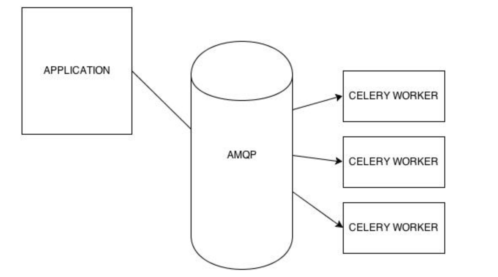
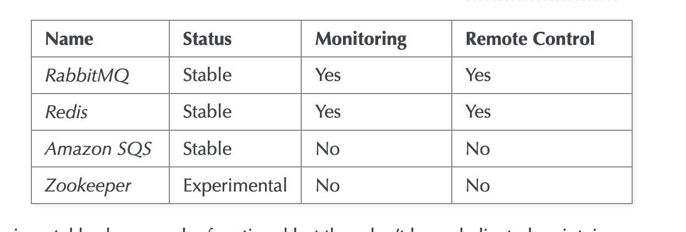
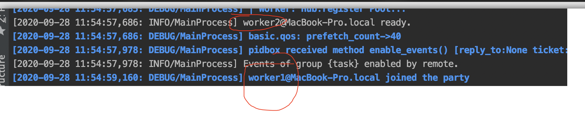
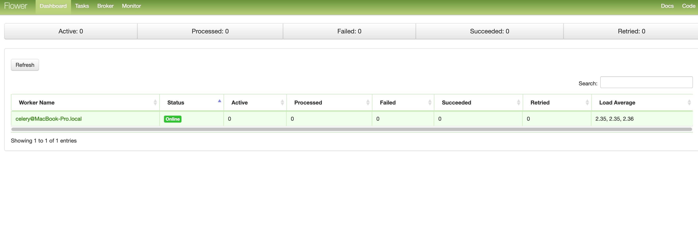
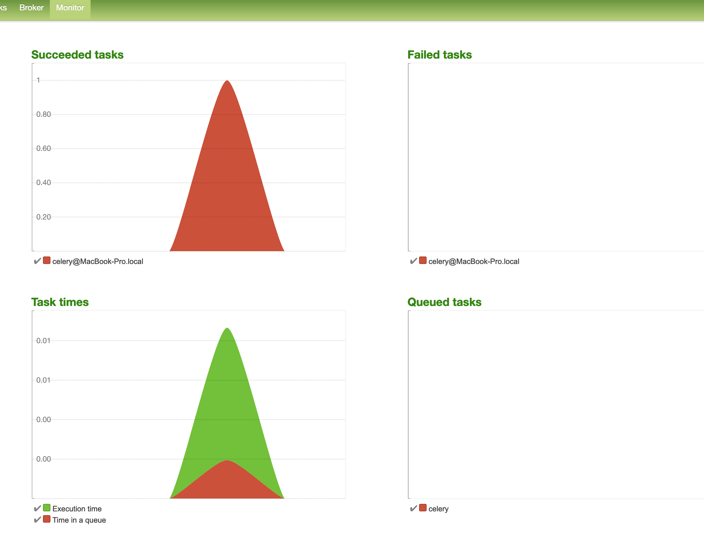

# what's celery

https://docs.celeryproject.org/en/stable/

Celery is a simple, flexible, and reliable distributed system to process vast amounts of messages, while providing operations with the tools required to maintain such a system.

It’s a task queue with focus on real-time processing, while also supporting task scheduling.

## features

1. Simple 
2. HA
3. Fast  ms level rrt
4. Monitoring, scheduling, time limits...

# Arch



amqp=advanced message queue protocol



# Easy to setup

```sh
pip install celery==4.4.7
不要安装最新版5.0 无法使用flower

start a worker:
celery -A tasks worker --loglevel=DEBUG --concurrency=10 -n worker1@%h
celery -A tasks worker --loglevel=DEBUG --concurrency=10 -n worker2@%h
```




```python
from celery import Celery

# broker to send requst task message
# backend to store result
app = Celery('tasks', backend="redis://localhost:7379", broker="redis://localhost:7379")

@app.task
def add(x, y):
    return x + y

@app.task
def subValue2(x):
    print("Sub func x=", x)
    return x-2
```


```python
from tasks import add
r = add.delay(4, 5) # AsyncResult 
x = r.get(timeout=10)
print(x)


or:
          while task.state == 'PENDING':
            time.sleep(self.celery_poll_interval)
            task = AsyncResult(task.id)

        if task.state == 'SUCCESS':
            logging.info('Success!')
```


```
celeryconfig.py
```


# key points

## tasks

1. ideally need to **idempotent**.

2. supports ACKs & rewind

3. task has a unique function name

4. use decorator @app.task
5. support retrys / retry for exception/ retry delay


## signatures

Wrap of (args, keywordargs, options of a invocation)

```python
add.s(2, 2).delay()

# callback
print(add.apply_async((2, 2), link=subValue2.s()).get())

```

## primitives

### chain

```python
print((add.s(4, 9) | subValue2.s() | add.s(8))().get())
```

execute in multiple workers seq.


### group

```python
res = group(add.s(i, i) for i in range(20))()
print(res.get(timeout=1))
```

execute in multiple workers parallel.


### chord

wait all tasks in a group is done and do another thing. seems countdownlatch?

```
res = chord((add.s(i, i) for i in range(10)), sumAll.s())()
print(res.get())
```


 ### others

https://docs.celeryproject.org/en/v4.4.7/userguide/canvas.html


## period tasks

**celery beat** is a scheduler; It kicks off tasks at regular intervals, that are then executed by available worker nodes in the cluster.

example conf:

```python
CELERY_BEAT_SCHEDULE = {
    'auto-sms-rating': {
        'task': 'auto_sms_rating',
        'schedule': crontab(minute='*/10'),
    }
}
```


## rountes

set the default queue name, message priority & etc.

```python
CELERY_TASK_ROUTES = {
			// see more on celeryconfig.py
}
```


# monitoring

by flower

```
pip install flower
celery flower -A proj --broker=redis://localhost:7379
```

then access it with localhost:5555



