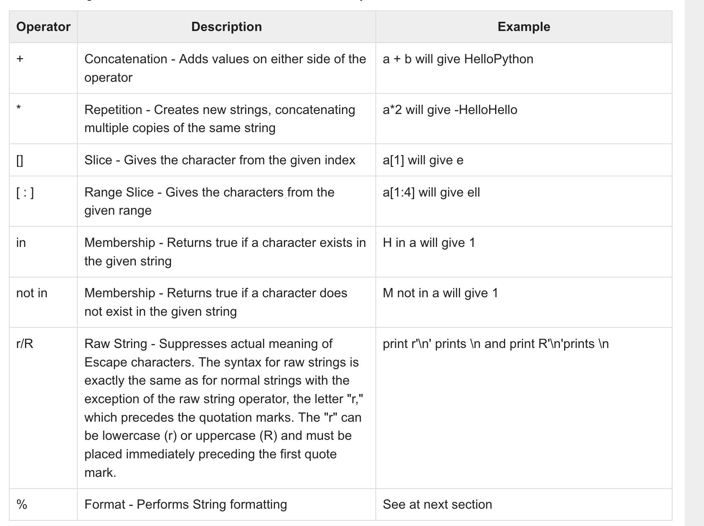
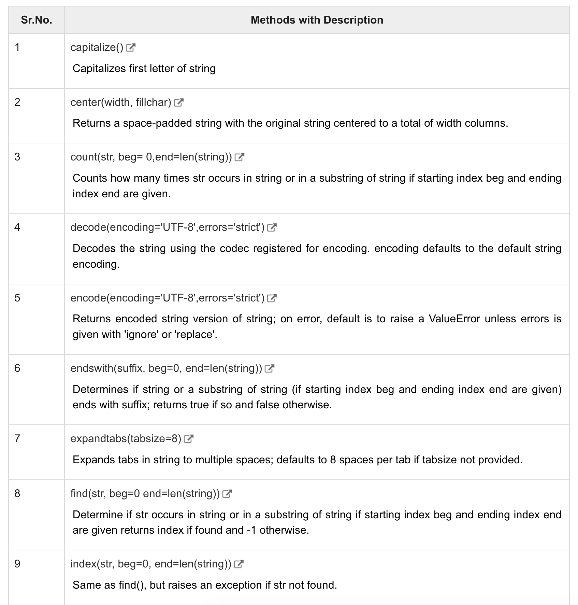
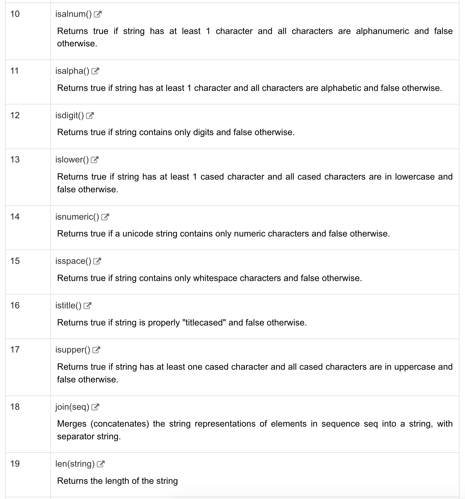
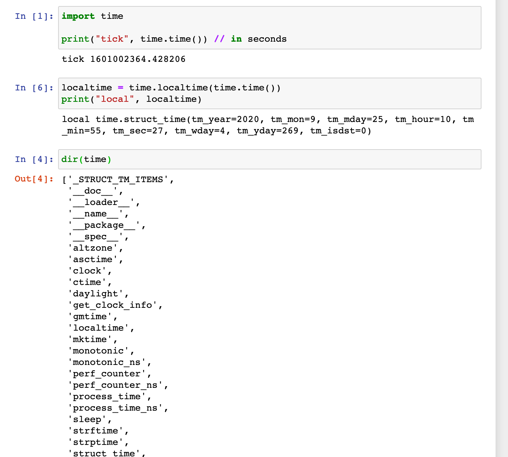
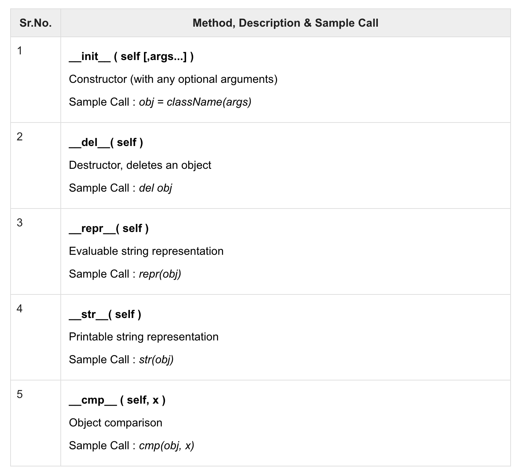

# Python


# basics

```
comment:
# this is comment

'''
multiple lines comment
'''

```

段落:

"""

hha

"""


## if else


```
if xxx:
	suite
elif xxxx:
	qqq
else:
	qqq
	
```


## variables


a,b,c=1, 2, "john"


## Strings

```python
str = 'Hello World!'

print str          # Prints complete string
print str[0]       # Prints first character of the string
print str[2:5]     # Prints characters starting from 3rd to 5th
print str[2:]      # Prints string starting from 3rd character
print str * 2      # Prints string two times
print str + "TEST" # Prints concatenated string
```


## lists

```python
list = [ 'abcd', 786 , 2.23, 'john', 70.2 ]
tinylist = [123, 'john']

print list          # Prints complete list
print list[0]       # Prints first element of the list
print list[1:3]     # Prints elements starting from 2nd till 3rd 
print list[2:]      # Prints elements starting from 3rd element
print tinylist * 2  # Prints list two times
print list + tinylist # Prints concatenated lists

list[2] = 123
del list[2]
list.append(345)

```

https://www.tutorialspoint.com/python/python_lists.htm

## tuple  = readonly list

```python
tuple = ( 'abcd', 786 , 2.23, 'john', 70.2  )
tinytuple = (123, 'john')

print tuple               # Prints the complete tuple
print tuple[0]            # Prints first element of the tuple
print tuple[1:3]          # Prints elements of the tuple starting from 2nd till 3rd 
print tuple[2:]           # Prints elements of the tuple starting from 3rd element
print tinytuple * 2       # Prints the contents of the tuple twice
print tuple + tinytuple   # Prints concatenated tuples
```


## dict

```python
dict = {}
dict ["hell"] = "world"
print tinydict.keys()   # Prints all the keys
print tinydict.values() # Prints all the values
del dict["name"]
```


## operators

```
==
!=

logical operators
and/ or/ not

member operators
in not in

is / is not


```

## loop

```python
while True:
	xxx
```

pass


```python
x = [1, 3, 5]
for v in x:
	print(v)
	
for i in range(len(x)):
	print(x[i])

  
 xx = [1, 3, 5, 7]
yy = [x*2 for x in xx]
print(yy) 
  
```


## numbers

```
abs
log
max(1, 2)
int("123") str(xxx)
```


## string operators



```python
print "hello %s and old %d" % ("hello", 21)
```


string format:

```python
print "hello %s and old %d" % ("hello", 21)
```


string methods:





https://www.tutorialspoint.com/python/python_strings.htm


## time




```
# time to string
strtime = time.asctime(time.localtime(time.time()))
print(strtime)
Fri Sep 25 10:56:20 2020
# all formats: https://www.tutorialspoint.com/python/time_strftime.htm
# long to time
# Fri Sep 25 10:52:44 2020  本地时区
t = time.localtime(1601002364)
print(time.asctime(t))
# long to string
print(time.strftime("%Y %m %d %H:%M:%S", t))


# string to long
print(time.strptime("2020 09 25 10:52:44", "%Y %m %d %H:%M:%S"))


Fri Sep 25 10:52:44 2020
2020 09 25 10:52:44
time.struct_time(tm_year=2020, tm_mon=9, tm_mday=25, tm_hour=10, tm_min=52, tm_sec=44, tm_wday=4, tm_yday=269, tm_isdst=-1)
```


## functions

```python
# Function definition is here
def printme( str ):
   "This prints a passed string into this function"
   print str
   return;
  
 
  
def printinfo( arg1, *vartuple ):
   "This prints a variable passed arguments"
   print "Output is: "
   print arg1
   for var in vartuple:
      print var
   return;

# Now you can call printinfo function
printinfo( 10 )
printinfo( 70, 60, 50 )


# Function definition is here
sum = lambda arg1, arg2: arg1 + arg2;

# Now you can call sum as a function
print "Value of total : ", sum( 10, 20 )
print "Value of total : ", sum( 20, 20 )


# 匿名函数
lamda a,b: a+b
  
```


## decorators

```python

def foo(*args):
	for a in args:
		print(a)
		
foo(1, 2, 3)

def bar(**kwargs):
	for a in kwargs:
		print(a, kwargs[a])
bar(name="hello", age=27)

```


```python
def do_twice(func):
    def wrapper_do_twice(*args, **kwargs):
        func(*args, **kwargs)
        func(*args, **kwargs)
    return wrapper_do_twice

@do_twice  
def hello(name):
  print("hello ", name)
  
    
```

ref:

https://realpython.com/primer-on-python-decorators/


## modules

```python
from time import xxx
import time
from time import *


import sys
print(sys.path)


import numpy
print(numpy.__version__)

dir(numpy)
```


## IO

```python
read from input:
str = raw_input("input sth")


testfile = open("test", "w+")
testfile.write("okay\n")
testfile.write("anotherline")
testfile.close()


r = open("test", "r")
x = r.read(50) # 50bytes
print(x)
r.close()

okay
anotherline

```

```python
# 按行读取
f = open("foo.txt")             # 返回一个文件对象  
line = f.readline()             # 调用文件的 readline()方法  
while line:  
    print line,                 # 后面跟 ',' 将忽略换行符  
    # print(line, end = '')　　　# 在 Python 3中使用  
    line = f.readline()  
 
f.close()  
方法二：
 
for line in open("foo.txt"):  
    print line,  
方法三：
 
f = open("c:\\1.txt","r")  
lines = f.readlines()#读取全部内容  
for line in lines  
    print line  

```


````python
os.rename(file1, file2)

os.remove(file1)

os.mkdir("testdir")

os.getcwd()

os.listdir()

import os
os.listdir(os.getcwd())
````


## exception

```python
import traceback
try:
    print("start cal")
    x = 1/0
    print("finish cal ok")
# except (RuntimeError, TypeError, NameError):    
except Exception as e:
    print("Error divide {0}".format(e) )
    traceback.print_exc()
    #traceback.print_exception(e)
finally:
    print("final part")
```


```python
def f(x):
    raise NameError(x)

f(123)   
```


```python
class Error(Exception):
    """Base class for exceptions in this module."""
    pass

class InputError(Error):
    """Exception raised for errors in the input.

    Attributes:
        expression -- input expression in which the error occurred
        message -- explanation of the error
    """

    def __init__(self, expression, message):
        self.expression = expression
        self.message = message

class TransitionError(Error):
    """Raised when an operation attempts a state transition that's not
    allowed.

    Attributes:
        previous -- state at beginning of transition
        next -- attempted new state
        message -- explanation of why the specific transition is not allowed
    """

    def __init__(self, previous, next, message):
        self.previous = previous
        self.next = next
        self.message = message


```


```python
with open("myfile.txt") as f:
    for line in f:
        print(line, end="")
```


# Class

```python
class Fruit:
    count = 0
    def __init__(self, name):
        self.name = name
    def getDisplay():
        return name + "me"
      
class SubClassName (ParentClass1[, ParentClass2, ...]):
   'Optional class documentation string'
   class_suite   
  
  
 
```


- The **getattr(obj, name[, default])** − to access the attribute of object.
- The **hasattr(obj,name)** − to check if an attribute exists or not.
- The **setattr(obj,name,value)** − to set an attribute. If attribute does not exist, then it would be created.
- The **delattr(obj, name)** − to delete an attribute.




# reg

```python
#!/usr/bin/python
import re

line = "Cats are smarter than dogs"

matchObj = re.match( r'(.*) are (.*?) .*', line, re.M|re.I)

if matchObj:
   print("matchObj.group() : ", matchObj.group())
   print("matchObj.group(1) : ", matchObj.group(1))
   print("matchObj.group(2) : ", matchObj.group(2))
else:
   print("No match!!")
```


# pycharm


export requirements:

```py
pip freeze > requirements.txt
pip install -i https://pypi.douban.com/simple/ -r requirements.txt
```


