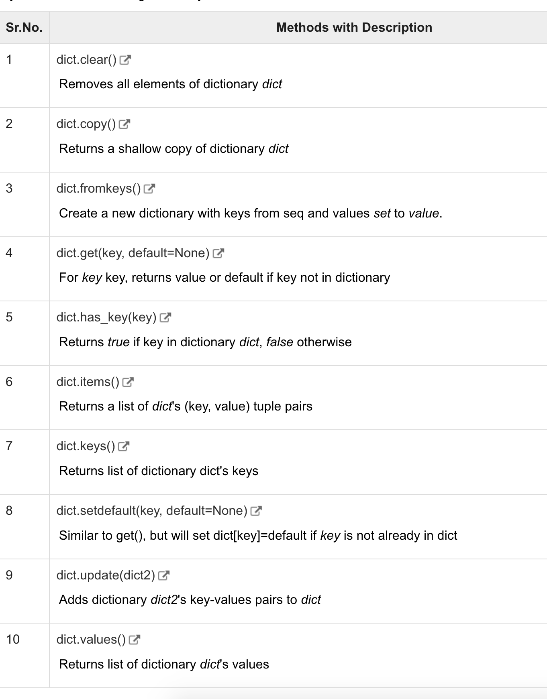

# Python


# basics

```
comment:
# this is comment

'''
multiple lines comment
'''

```

段落:

"""

hha

"""


## if else


```
if xxx:
	suite
elif xxxx:
	qqq
else:
	qqq
```


## variables


a,b,c=1, 2, "john"


## Strings

```python
str = 'Hello World!'

print str          # Prints complete string
print str[0]       # Prints first character of the string
print str[2:5]     # Prints characters starting from 3rd to 5th
print str[2:]      # Prints string starting from 3rd character
print str * 2      # Prints string two times
print str + "TEST" # Prints concatenated string
```


## lists

```python
list = [ 'abcd', 786 , 2.23, 'john', 70.2 ]
tinylist = [123, 'john']

print list          # Prints complete list
print list[0]       # Prints first element of the list
print list[1:3]     # Prints elements starting from 2nd till 3rd 
print list[2:]      # Prints elements starting from 3rd element
print tinylist * 2  # Prints list two times
print list + tinylist # Prints concatenated lists

list[2] = 123
del list[2]
list.append(345)

```

https://www.tutorialspoint.com/python/python_lists.htm

## tuple  = readonly list

```python
tuple = ( 'abcd', 786 , 2.23, 'john', 70.2  )
tinytuple = (123, 'john')

print tuple               # Prints the complete tuple
print tuple[0]            # Prints first element of the tuple
print tuple[1:3]          # Prints elements of the tuple starting from 2nd till 3rd 
print tuple[2:]           # Prints elements of the tuple starting from 3rd element
print tinytuple * 2       # Prints the contents of the tuple twice
print tuple + tinytuple   # Prints concatenated tuples
```


## dict

```python
dict = {}
dict ["hell"] = "world"
print tinydict.keys()   # Prints all the keys
print tinydict.values() # Prints all the values
del dict["name"]
```




## operators

```
==
!=

logical operators
and/ or/ not

member operators
in not in

is / is not


```

## loop

```python
while True:
	xxx
```

pass


```python
x = [1, 3, 5]
for v in x:
	print(v)
	
for i in range(len(x)):
	print(x[i])

```


## numbers

```
abs
log
max(1, 2)
int
```


## string operators


```python
print "hello %s and old %d" % ("hello", 21)
```


string format:

```python
print "hello %s and old %d" % ("hello", 21)
```


string methods:


https://www.tutorialspoint.com/python/python_strings.htm


## time

```python

```


## functions

```python
# Function definition is here
def printme( str ):
   "This prints a passed string into this function"
   print str
   return;
  
def printinfo( arg1, *vartuple ):
   "This prints a variable passed arguments"
   print "Output is: "
   print arg1
   for var in vartuple:
      print var
   return;

# Now you can call printinfo function
printinfo( 10 )
printinfo( 70, 60, 50 )


# Function definition is here
sum = lambda arg1, arg2: arg1 + arg2;

# Now you can call sum as a function
print "Value of total : ", sum( 10, 20 )
print "Value of total : ", sum( 20, 20 )
```


# pycharm


export requirements:

```py
pip freeze > requirements.txt
pip install -r requirements.txt
```

